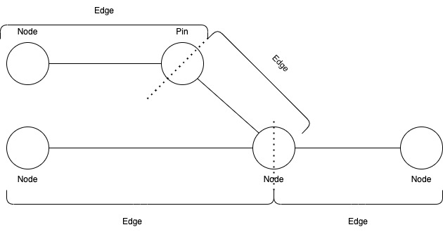

# Results
## Output

We have multiple **Nodes** and **Pins**. A Pin has only one preceding node; if it has more, it becomes a node itself. Pins help create clean lines (edges) between nodes.

Each edge can include multiple symbols.

The output will be saved as an SVG file, allowing access to the information embedded in the image. It is important that nodes and edges are directly connected, not just by pixels, so they can be effectively interpreted.

For transparency, the file `non-resolved-parts.png` shows all components we were not able to read, so the client knows what information we couldn't retrieve and could potentially include in the output.